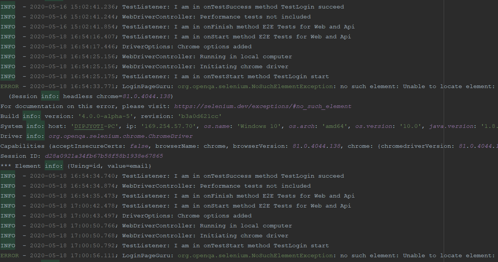

# HybridTestFramework

### Architecture

### Supported Platforms

This framework supports WebUi automation across a variety of browsers like Chrome, Firefox, IE, no only limited to this
but extended to test rest api, security and visual testing.

### Capabilities

* Cross browser testing support
* Added browserstack support for CrossBrowser testing
* Running tests in docker containers selenium grid
* Running tests in AWS DeviceFarm selenium grid
* Running tests in selenium server in docker containers
* Security testing using OWASP, running in docker container
* Api testing support using RestAssured
* Visual regression testing using percy.io
* Accessibility testing using axe-selenium
* Stubbed api testing using WireMock
* Can send logs to ElasticSearch for kibana dashboard visualization
* Database testing support
* Kafka testing support
* Kubernetes support

### JenkinsExecution

### GridServer 2.0

### Allure Reporting

### Gradle Report

### Azure devops TestResults

### BrowserStack Dashboard

### LogsView

