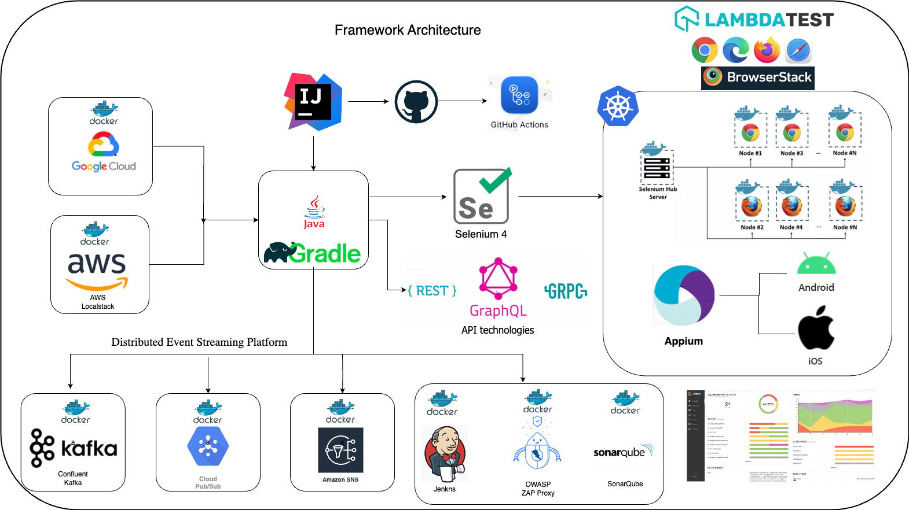
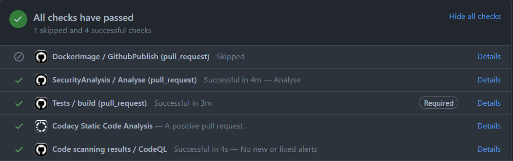

# HybridTestFramework

### Architecture

In the era of [cloud-native](https://docs.microsoft.com/en-us/dotnet/architecture/cloud-native/definition) world we
cannot stick to a particular framework, however due to projects requirement we often need to evolve the existing testing
solution in such a way so that it can cater multiple testing requirement,
hence [HybridTestFramework](https://github.com/dipjyotimetia/HybridTestFramework) is targeting to create a bridge
between the kind of legacy systems
or the systems which are still in a transition phase of migrate to cloud with super cool cloud-native systems.
Also, it's worth to mention as we are trying to follow the pattern
of [testing pyramid](https://martinfowler.com/articles/practical-test-pyramid.html) where the testing is more focused
for the api followed by WebUI, in future
the framework focus will be more towards the apis and events.

### Framework Capabilities

* Cross browser testing support.
* Added browserstack support for CrossBrowser testing.
* Running tests in docker containers selenium grid.
* Running tests in AWS DeviceFarm selenium grid.
* Running tests in selenium server in docker containers.
* Security testing using OWASP, running in docker container.
* Rest Api and GraphQL testing support powered by RestAssured.
* gRPC api testing support using native gRPC=java library.
* Event driven microservice testing based on pubsub model.
* Support for Kafka, Cloud Pubsub, AWS SNS testing and continue evolving.
* Visual regression testing using percy.io.
* Accessibility testing using axe-selenium.
* Stubbed api testing using WireMock.
* Can send logs to ElasticSearch for kibana dashboard visualization.
* Database testing support.
* Kubernetes support.

### GitHub actions execution

### JenkinsExecution

### Azure devops TestResults

### Allure Reporting

### BrowserStack Dashboard

