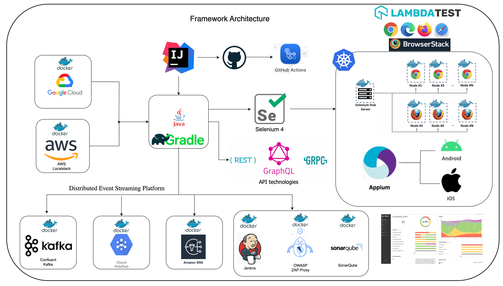

# HybridTestFramework

### Architecture

### Supported testing patterns

This framework supports WebUi automation across a variety of browsers like Chrome, Firefox, IE, no only limited to this
but extended to test rest, graphql, gRPC api, event driven testing, security and visual testing.

### Framework Capabilities

* Cross browser testing support.
* Added browserstack support for CrossBrowser testing.
* Running tests in docker containers selenium grid.
* Running tests in AWS DeviceFarm selenium grid.
* Running tests in selenium server in docker containers.
* Security testing using OWASP, running in docker container.
* Rest Api and GraphQL testing support powered by RestAssured.
* gRPC api testing support using native gRPC=java library.
* Event driven microservice testing based on pubsub model.
* Support for Kafka, Cloud Pubsub, AWS SNS testing and continue evolving.
* Visual regression testing using percy.io.
* Accessibility testing using axe-selenium.
* Stubbed api testing using WireMock.
* Can send logs to ElasticSearch for kibana dashboard visualization.
* Database testing support.
* Kubernetes support.

### GitHub actions execution

### JenkinsExecution

### Azure devops TestResults

### Allure Reporting

### BrowserStack Dashboard

