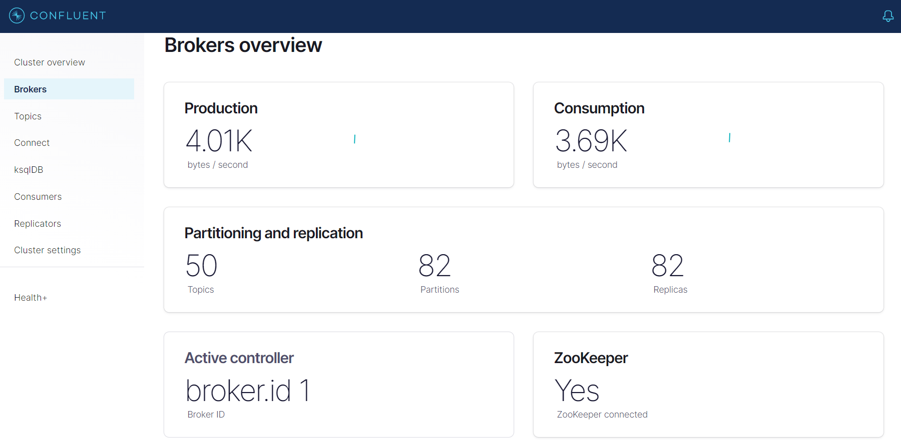
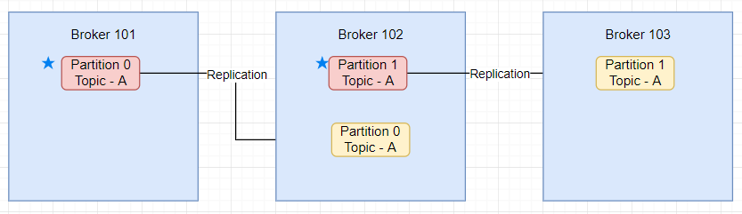
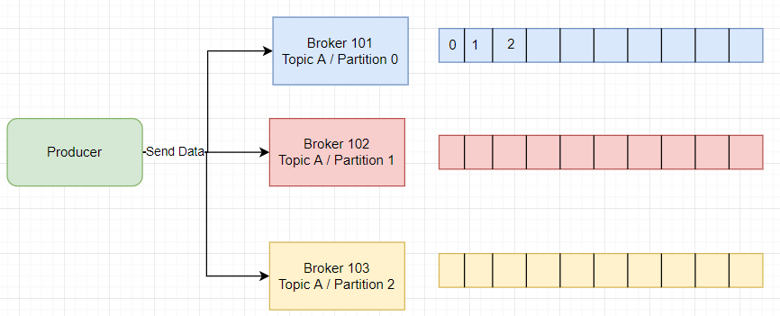
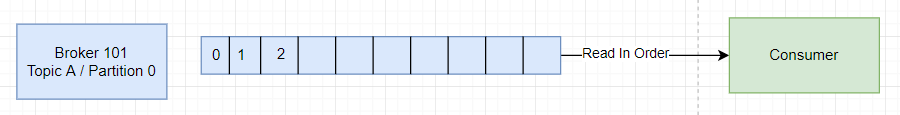
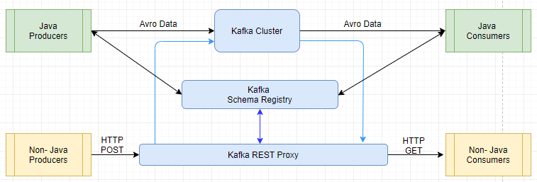

# Kafka Testing

## What is Apache Kafka?

Apache Kafka is a framework implementation of a software bus using stream-processing. It is an open-source software
platform developed by the Apache Software Foundation written in Scala and Java.
The project aims to provide a unified, high-throughput, low-latency platform for handling real-time data feeds.
Behind the scenes, Kafka is distributed, scales well, replicates data across brokers (servers), can survive broker
downtime, and much more.





## Topics, Partitions and Offsets

**Topics: A particular stream of data**

* Similar to a table of the database
* You can have as many topics you can
* A topic is identified by its name

**Topics are split in partitions**

* Each partition is ordered
* Each message in partition will get an incremental ID called offset
* Partition 0, 1, 2 ....
* Order only guaranteed within a partition, not across partitions
* Data is kept only for a limited time.
* Once the data is written to a partition it cannot be changed.

Example Scenario :
You can have multiple cabs, and each cabs reports its GPS location to kafka. You can have a topic cabs_gps that contains
the position of all cabs. Each cab will send a message to kafka every 20 sec, each message will contain the cabID, and
the cab location(lat/long)

## Brokers & Topics

* A kafka cluster is composed of multiple brokers(servers)
* Each broker is identified by its ID(integer)
* Each broker contains certain topic partitions
* After connecting to any broker(called a bootstrap broker), you will be connected to the entire cluster
* A good number to get start is 3 brokers, but some big clusters have more than 100 brokers

Example of topic A with 3 partitions   
Example of topic B with 2 partitions   


## Topics replication

* Topics should have a replication factor >1 (Usually between 2 and 3)
* This way if one broker is down another broker can serve the data. Example of topic A with replication factor 2
  

* At any time only ONE broker can be a leader for a given partition
* Only that leader can receive and serve data for a partition.
* The other broker will synchronize the data.
* So each partition has one leader and multiple ISR (in-sync-replica)
  

## Producer

* Producer write data to topics(which is made of partitions)
* Producer automatically know to which broker and partition to write.
* In case broker failure, Producers will automatically recover
  
* Producers can choose to receive acknowledgment of data writes.
    * acks=0 Producer won't wait for acknowledgment (Possible data loss)
    * acks=1 Producer will wait for leader acknowledgment (Limited data loss)
    * acks=2 Leader & Replica acknowledgment (no data loss)
* Producer can choose to send a key with the message(string,num etc.)
* If key==null data will sent round robin(broker 101 then 102 then 103)
* If key is sent then all message for that key will send to same partition
* A key is sent if we need a message ordering for a specific field as cabID.

## Consumer

* Consumer read data from a topic(identified by name)
* Consumer knows which broker to read from
* In case of broker failure, consumer know how to recover
* Data is read in order with in each partition
  
* Consumer read data in consumer groups
* Each consumer within a group reads form exclusive partitions
* If you have more consumers than partitions, some consumers will be inactive
* Kafka stores the offset at which a consumer group has been reading
* The offsets committed live in a kafka topic named _consumer_offsets
* When a consumer in a group has processed the data received from kafka, it should be committing the offsets.
* If a consumer dies, it will be able to read back from where it left off.

## Zookeeper

* Zookeeper manager brokers(keeps a list of them)
* Zookeeper helps in performing leader election for partition
* Zookeeper send notifications to kafka in case of any changes.

## Schema Registry

* Kafka takes bytes as an input and publishes them
* No data verification
* Schema registry rejects bat data
* A common data format must be agreed upon   
  
* Apache avro as data format
    * Data is fully typed
    * Date is compressed automatically
    * Schema comes along with the data
    * Documentation is embedded in the schema
    * Data can be read across any language
    * Schema can be evolved over time in safe manner

## Avro

Apache Avro is a data serialization system.

* Avro provides:
    * Rich data structures.
    * A compact, fast, binary data format.
    * A container file, to store persistent data.
    * Remote procedure call (RPC).
    * Simple integration with dynamic languages. Code generation is not required to read or write data files nor to use
      or implement RPC protocols. Code generation as an optional optimization, only worth implementing for statically
      typed languages.

```avroschema
{"namespace": "dip.avro",
  "type": "record",
  "name": "User",
  "fields": [
    {"name": "name", "type": "string"},
    {"name": "favorite_number",  "type": ["int", "null"]},
    {"name": "favorite_color", "type": ["string", "null"]}
  ]
}
```

* Common Fields:
    * Name: Name of the schema
    * Namespace: (equivalent of package in java)
    * Doc: Documentation to explain your schema
    * Aliases: Optional other name for schema
    * Fields
        * Name: Name of field
        * Doc: Documentation for that field
        * Type: Data type for that field
        * Default: Default value for that field
    * Complex types:
        * Enums
          ```avroschema
          {
            "type": "enum",
            "name": "Customer Status",
            "symbols": ["BRONZE","SILVER","GOLD"]
          }
          ```
        * Arrays
          ```avroschema
          {
            "type": "array",
            "items": "string"
          }
          ```
        * Maps
          ```avroschema
          {
            "type": "map",
            "values": "string"
          }
          ```
        * Unions
          ```avroschema
          {
            "name": "middle_name",
            "type": [
              "null",
              "string"
            ],
            "default": "null"
          }
          ```
        * Calling other schema as type

## Kafka Rest Proxy

* kafka is great for java based consumers/producers
* Avro support for some languages isn't great, where JSON/HTTP requests are great.
* Reporting data to Kafka from any frontend app built in any language not supported by official Confluent clients
* Ingesting messages into a stream processing framework that doesn’t yet support Kafka   
  
* Perform a comprehensive set of administrative operations through REST APIs, including:
    * Describe, list, and configure brokers
    * Create, delete, describe, list, and configure topics
    * Delete, describe, and list consumer groups
    * Create, delete, describe, and list ACLs
    * List partition reassignments     
